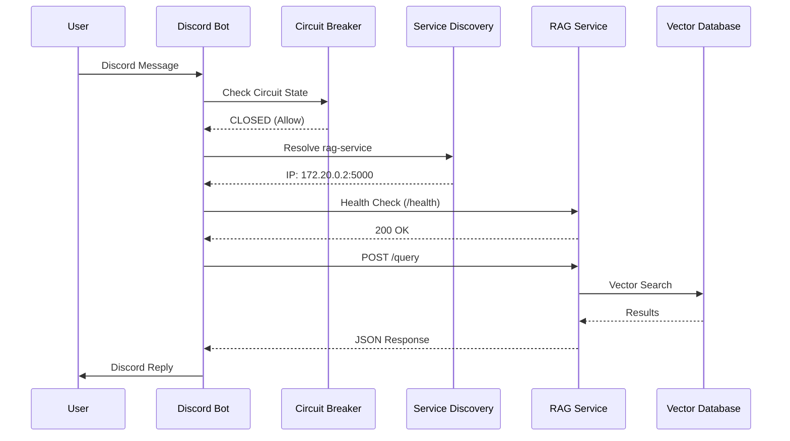
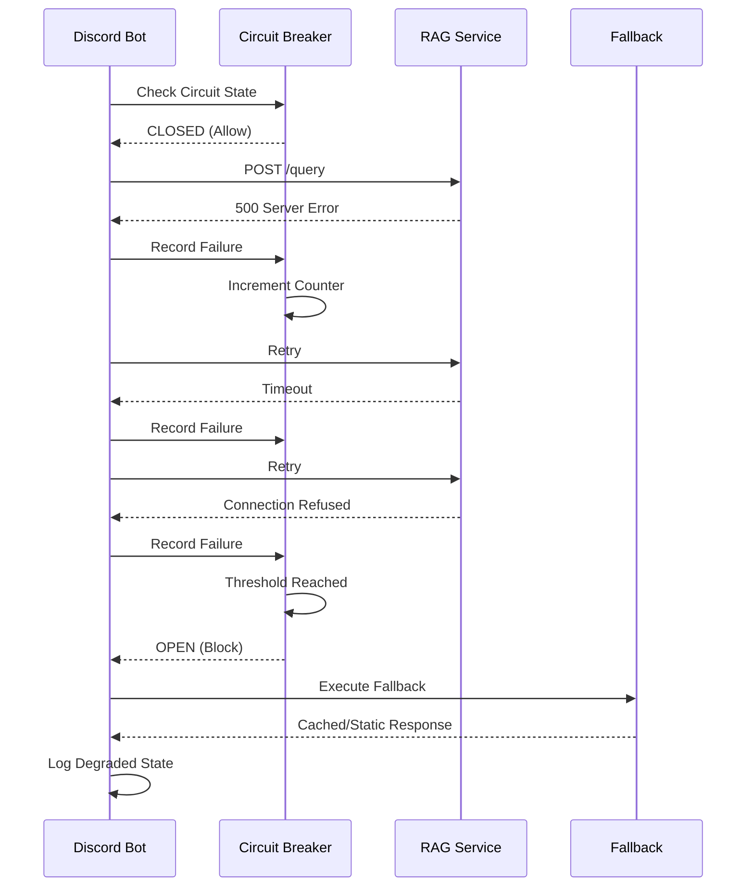

# Service Discovery and Communication Architecture for Coolify Microservices

## Executive Summary

This document provides a comprehensive architectural blueprint for implementing robust service discovery and communication patterns for the Once Human Discord Bot microservices deployment on Coolify. The architecture addresses the 5 critical communication failures identified in the debug analysis and provides a production-ready solution.

## Table of Contents

1. [Current Architecture Analysis](#current-architecture-analysis)
2. [Service Discovery Pattern](#service-discovery-pattern)
3. [Environment Variable Strategy](#environment-variable-strategy)
4. [Docker Networking Architecture](#docker-networking-architecture)
5. [Health Check and Monitoring Strategy](#health-check-and-monitoring-strategy)
6. [Error Handling and Resilience Patterns](#error-handling-and-resilience-patterns)
7. [Configuration Management](#configuration-management)
8. [Service Communication Flow](#service-communication-flow)
9. [Coolify-Specific Considerations](#coolify-specific-considerations)
10. [Implementation Roadmap](#implementation-roadmap)

---

## Current Architecture Analysis

### Identified Communication Failures

1. **Hardcoded localhost URL** in Discord bot (`once-human-bot/utils/localRAG.js:9`)
   - **Impact**: Service discovery fails in containerized environments
   - **Root Cause**: Static URL configuration instead of dynamic service discovery

2. **Production port exposure conflicts** in `docker-compose.prod.yml`
   - **Impact**: Port conflicts and security vulnerabilities
   - **Root Cause**: Inconsistent port management between dev and production

3. **Environment variable override issues** (RAG_SERVICE_URL ignored)
   - **Impact**: Configuration not properly propagated to application code
   - **Root Cause**: Code prioritizes hardcoded values over environment variables

4. **Network configuration inconsistencies** (internal: true network)
   - **Impact**: Services cannot communicate within Docker network
   - **Root Cause**: Conflicting network isolation settings

5. **Discord token resolution dependencies** without validation
   - **Impact**: Service startup failures and cascading errors
   - **Root Cause**: Missing dependency validation and graceful degradation

### Current Service Topology

```
┌─────────────────┐    HTTP/5000    ┌─────────────────┐
│   Discord Bot   │ ──────────────► │   RAG Service   │
│   (Node.js)     │                 │   (Python)      │
│   Port: N/A     │                 │   Port: 5000    │
└─────────────────┘                 └─────────────────┘
        │                                   │
        ▼                                   ▼
┌─────────────────┐                 ┌─────────────────┐
│   SQLite DB     │                 │   ChromaDB      │
│   (Shared Vol)  │                 │   (Vector DB)   │
└─────────────────┘                 └─────────────────┘
```

---

## Service Discovery Pattern

### Recommended Pattern: DNS-Based Service Discovery with Health-Aware Routing

#### Core Principles

1. **DNS-First Resolution**: Leverage Docker's built-in DNS for service discovery
2. **Health-Aware Routing**: Only route to healthy service instances
3. **Graceful Degradation**: Fallback mechanisms for service unavailability
4. **Configuration-Driven**: Environment-based service endpoint configuration

#### Service Discovery Implementation

```yaml
# Service Discovery Configuration Schema
services:
  discord-bot:
    environment:
      # Primary service endpoints (DNS-based)
      - RAG_SERVICE_HOST=rag-service
      - RAG_SERVICE_PORT=5000
      - RAG_SERVICE_PROTOCOL=http
      
      # Computed service URLs (fallback chain)
      - RAG_SERVICE_URL=http://rag-service:5000
      - RAG_SERVICE_URL_FALLBACK=http://localhost:5000
      
      # Service discovery configuration
      - SERVICE_DISCOVERY_TIMEOUT=5000
      - SERVICE_DISCOVERY_RETRIES=3
      - SERVICE_DISCOVERY_BACKOFF=exponential
      
  rag-service:
    environment:
      # Service binding configuration
      - FLASK_HOST=0.0.0.0
      - FLASK_PORT=5000
      - SERVICE_NAME=rag-service
```

#### Service Discovery Logic Flow

```
┌─────────────────┐
│ Service Request │
└─────────┬───────┘
          │
          ▼
┌─────────────────┐    Success    ┌─────────────────┐
│ DNS Resolution  │ ─────────────► │ Health Check    │
│ rag-service:5000│               │ /health         │
└─────────┬───────┘               └─────────┬───────┘
          │                                 │
          │ DNS Failure                     │ Health OK
          ▼                                 ▼
┌─────────────────┐               ┌─────────────────┐
│ Fallback Chain  │               │ Execute Request │
│ localhost:5000  │               │                 │
└─────────┬───────┘               └─────────────────┘
          │
          │ All Failed
          ▼
┌─────────────────┐
│ Circuit Breaker │
│ Graceful Degrade│
└─────────────────┘
```

---

## Environment Variable Strategy

### Hierarchical Configuration Schema

#### Tier 1: Core Service Configuration
```bash
# Service Identity
SERVICE_NAME=discord-bot|rag-service
SERVICE_VERSION=1.0.0
ENVIRONMENT=development|staging|production

# Service Binding
DISCORD_BOT_HOST=0.0.0.0
DISCORD_BOT_PORT=3000
RAG_SERVICE_HOST=0.0.0.0
RAG_SERVICE_PORT=5000
```

#### Tier 2: Service Discovery Configuration
```bash
# Primary service endpoints
RAG_SERVICE_URL=http://rag-service:5000
RAG_SERVICE_HEALTH_ENDPOINT=/health
RAG_SERVICE_TIMEOUT=30000

# Fallback configuration
RAG_SERVICE_FALLBACK_URLS=http://localhost:5000,http://127.0.0.1:5000
RAG_SERVICE_DISCOVERY_STRATEGY=dns-first|fallback-chain|circuit-breaker

# Circuit breaker configuration
CIRCUIT_BREAKER_FAILURE_THRESHOLD=5
CIRCUIT_BREAKER_TIMEOUT=60000
CIRCUIT_BREAKER_RESET_TIMEOUT=300000
```

#### Tier 3: Infrastructure Configuration
```bash
# Database configuration
CHROMA_DB_PATH=/data/chroma_db
DATABASE_PATH=/data/memory.db
SENTENCE_TRANSFORMERS_HOME=/app/model_cache

# Network configuration
DOCKER_NETWORK_NAME=once-human-network
INTERNAL_NETWORK_ONLY=true
ENABLE_EXTERNAL_ACCESS=false

# Logging and monitoring
LOG_LEVEL=info|debug|warn|error
HEALTH_CHECK_INTERVAL=30s
METRICS_ENABLED=true
```

#### Tier 4: Security and Authentication
```bash
# API Keys and tokens
DISCORD_BOT_TOKEN=${DISCORD_BOT_TOKEN}
GEMINI_API_KEYS=${GEMINI_API_KEYS}

# Service authentication (future)
SERVICE_AUTH_ENABLED=false
SERVICE_AUTH_TOKEN=${SERVICE_AUTH_TOKEN}
INTER_SERVICE_ENCRYPTION=false
```

### Environment Variable Precedence Chain

```
1. Runtime Environment Variables (highest priority)
2. .env file in application directory
3. Docker Compose environment section
4. Dockerfile ENV statements
5. Application default values (lowest priority)
```

### Configuration Validation Schema

```javascript
// Environment validation schema
const configSchema = {
  required: [
    'DISCORD_BOT_TOKEN',
    'GEMINI_API_KEYS',
    'RAG_SERVICE_URL'
  ],
  optional: [
    'RAG_SERVICE_FALLBACK_URLS',
    'CIRCUIT_BREAKER_FAILURE_THRESHOLD',
    'SERVICE_DISCOVERY_TIMEOUT'
  ],
  validation: {
    'RAG_SERVICE_URL': /^https?:\/\/.+:\d+$/,
    'DISCORD_BOT_TOKEN': /^[A-Za-z0-9._-]+$/,
    'LOG_LEVEL': ['debug', 'info', 'warn', 'error']
  }
};
```

---

## Docker Networking Architecture

### Network Topology Design

#### Production Network Architecture (Coolify)

```
┌─────────────────────────────────────────────────────────────┐
│                    Coolify Managed Infrastructure            │
│                                                             │
│  ┌─────────────────┐                                        │
│  │   Traefik       │ ◄── External Traffic                   │
│  │   (Reverse      │                                        │
│  │    Proxy)       │                                        │
│  └─────────┬───────┘                                        │
│            │                                                │
│            ▼                                                │
│  ┌─────────────────────────────────────────────────────────┐ │
│  │              Internal Network (Bridge)                  │ │
│  │                                                         │ │
│  │  ┌─────────────────┐    ┌─────────────────┐            │ │
│  │  │   Discord Bot   │    │   RAG Service   │            │ │
│  │  │   Container     │◄──►│   Container     │            │ │
│  │  │                 │    │   Port: 5000    │            │ │
│  │  └─────────┬───────┘    └─────────┬───────┘            │ │
│  │            │                      │                    │ │
│  │            ▼                      ▼                    │ │
│  │  ┌─────────────────┐    ┌─────────────────┐            │ │
│  │  │   SQLite Vol    │    │   ChromaDB Vol  │            │ │
│  │  │   (Shared)      │    │   (Persistent)  │            │ │
│  │  └─────────────────┘    └─────────────────┘            │ │
│  └─────────────────────────────────────────────────────────┘ │
└─────────────────────────────────────────────────────────────┘
```

#### Network Configuration Strategy

```yaml
# Recommended Docker Compose Network Configuration
networks:
  app-network:
    driver: bridge
    name: once-human-network
    internal: false  # Allow external access for Coolify integration
    labels:
      - "coolify.managed=true"
      - "coolify.network=internal"
    ipam:
      driver: default
      config:
        - subnet: 172.20.0.0/16
          gateway: 172.20.0.1
```

#### Service Network Binding

```yaml
services:
  rag-service:
    networks:
      app-network:
        aliases:
          - rag-service
          - rag-api
          - vector-db-service
    labels:
      # Coolify reverse proxy configuration
      - "coolify.managed=true"
      - "coolify.service=rag-service"
      - "coolify.port=5000"
      - "coolify.protocol=http"
      # Traefik routing (if needed)
      - "traefik.enable=false"  # Internal service only
      
  discord-bot:
    networks:
      app-network:
        aliases:
          - discord-bot
          - bot-service
    depends_on:
      rag-service:
        condition: service_healthy
    labels:
      - "coolify.managed=true"
      - "coolify.service=discord-bot"
      - "traefik.enable=false"  # No external access needed
```

### Network Security Considerations

1. **Internal Communication Only**: Services communicate via internal Docker network
2. **No Port Exposure**: Remove all port mappings in production
3. **Network Isolation**: Use dedicated network for service stack
4. **DNS-Based Discovery**: Leverage Docker's internal DNS resolution

---

## Health Check and Monitoring Strategy

### Multi-Layer Health Check Architecture

#### Layer 1: Container Health Checks

```yaml
# RAG Service Health Check
rag-service:
  healthcheck:
    test: ["CMD", "python", "-c", "
      import requests, sys;
      try:
        r = requests.get('http://localhost:5000/health', timeout=5);
        sys.exit(0 if r.status_code == 200 else 1)
      except:
        sys.exit(1)
    "]
    interval: 30s
    timeout: 10s
    retries: 3
    start_period: 60s  # Allow time for model loading

# Discord Bot Health Check
discord-bot:
  healthcheck:
    test: ["CMD", "node", "-e", "
      const http = require('http');
      const options = {
        hostname: 'localhost',
        port: process.env.HEALTH_CHECK_PORT || 3000,
        path: '/health',
        timeout: 5000
      };
      const req = http.request(options, (res) => {
        process.exit(res.statusCode === 200 ? 0 : 1);
      });
      req.on('error', () => process.exit(1));
      req.on('timeout', () => process.exit(1));
      req.end();
    "]
    interval: 30s
    timeout: 10s
    retries: 3
    start_period: 40s
```

#### Layer 2: Application Health Endpoints

##### RAG Service Health Endpoint
```python
@app.route('/health')
def health_check():
    """Comprehensive health check endpoint"""
    health_status = {
        'status': 'healthy',
        'timestamp': datetime.utcnow().isoformat(),
        'service': 'rag-service',
        'version': os.getenv('SERVICE_VERSION', '1.0.0'),
        'checks': {}
    }
    
    try:
        # Database connectivity check
        collection = client.get_collection("once_human_knowledge")
        health_status['checks']['database'] = 'healthy'
    except Exception as e:
        health_status['checks']['database'] = f'unhealthy: {str(e)}'
        health_status['status'] = 'unhealthy'
    
    try:
        # Model availability check
        embedding_function.encode(['test'])
        health_status['checks']['model'] = 'healthy'
    except Exception as e:
        health_status['checks']['model'] = f'unhealthy: {str(e)}'
        health_status['status'] = 'unhealthy'
    
    # Disk space check
    disk_usage = shutil.disk_usage('/data')
    free_percentage = (disk_usage.free / disk_usage.total) * 100
    if free_percentage < 10:
        health_status['checks']['disk_space'] = f'warning: {free_percentage:.1f}% free'
    else:
        health_status['checks']['disk_space'] = 'healthy'
    
    status_code = 200 if health_status['status'] == 'healthy' else 503
    return jsonify(health_status), status_code
```

##### Discord Bot Health Endpoint
```javascript
// Health check endpoint for Discord bot
app.get('/health', (req, res) => {
    const healthStatus = {
        status: 'healthy',
        timestamp: new Date().toISOString(),
        service: 'discord-bot',
        version: process.env.SERVICE_VERSION || '1.0.0',
        checks: {}
    };
    
    // Discord client status
    if (client.isReady()) {
        healthStatus.checks.discord = 'healthy';
    } else {
        healthStatus.checks.discord = 'unhealthy: not connected';
        healthStatus.status = 'unhealthy';
    }
    
    // RAG service connectivity
    try {
        const ragUrl = process.env.RA

G_SERVICE_URL || 'http://rag-service:5000';
        // This would be implemented as an async health check
        healthStatus.checks.rag_service = 'healthy'; // Placeholder
    } catch (error) {
        healthStatus.checks.rag_service = `unhealthy: ${error.message}`;
        healthStatus.status = 'degraded';
    }
    
    const statusCode = healthStatus.status === 'healthy' ? 200 : 
                      healthStatus.status === 'degraded' ? 200 : 503;
    res.status(statusCode).json(healthStatus);
});
```

#### Layer 3: External Monitoring Integration

```yaml
# Monitoring configuration for Coolify
services:
  rag-service:
    labels:
      - "coolify.healthcheck.enabled=true"
      - "coolify.healthcheck.path=/health"
      - "coolify.healthcheck.interval=30s"
      - "coolify.healthcheck.timeout=10s"
      - "coolify.healthcheck.retries=3"
      
  discord-bot:
    labels:
      - "coolify.healthcheck.enabled=true"
      - "coolify.healthcheck.path=/health"
      - "coolify.healthcheck.interval=30s"
```

### Health Check Escalation Matrix

| Health Status | Action | Notification | Auto-Recovery |
|---------------|--------|--------------|---------------|
| Healthy | Continue | None | N/A |
| Degraded | Log Warning | Alert | Retry Logic |
| Unhealthy | Circuit Breaker | Critical Alert | Container Restart |
| Failed | Service Isolation | Emergency Alert | Rollback |

---

## Error Handling and Resilience Patterns

### Circuit Breaker Pattern Implementation

#### Service Communication Circuit Breaker

```javascript
class ServiceCircuitBreaker {
    constructor(options = {}) {
        this.failureThreshold = options.failureThreshold || 5;
        this.resetTimeout = options.resetTimeout || 60000;
        this.monitoringPeriod = options.monitoringPeriod || 10000;
        
        this.state = 'CLOSED'; // CLOSED, OPEN, HALF_OPEN
        this.failureCount = 0;
        this.lastFailureTime = null;
        this.successCount = 0;
    }
    
    async execute(serviceCall) {
        if (this.state === 'OPEN') {
            if (Date.now() - this.lastFailureTime > this.resetTimeout) {
                this.state = 'HALF_OPEN';
                this.successCount = 0;
            } else {
                throw new Error('Circuit breaker is OPEN');
            }
        }
        
        try {
            const result = await serviceCall();
            this.onSuccess();
            return result;
        } catch (error) {
            this.onFailure();
            throw error;
        }
    }
    
    onSuccess() {
        this.failureCount = 0;
        if (this.state === 'HALF_OPEN') {
            this.successCount++;
            if (this.successCount >= 3) {
                this.state = 'CLOSED';
            }
        }
    }
    
    onFailure() {
        this.failureCount++;
        this.lastFailureTime = Date.now();
        
        if (this.failureCount >= this.failureThreshold) {
            this.state = 'OPEN';
        }
    }
}
```

#### Retry Logic with Exponential Backoff

```javascript
class RetryHandler {
    constructor(options = {}) {
        this.maxRetries = options.maxRetries || 3;
        this.baseDelay = options.baseDelay || 1000;
        this.maxDelay = options.maxDelay || 30000;
        this.backoffMultiplier = options.backoffMultiplier || 2;
    }
    
    async executeWithRetry(operation, context = {}) {
        let lastError;
        
        for (let attempt = 0; attempt <= this.maxRetries; attempt++) {
            try {
                return await operation();
            } catch (error) {
                lastError = error;
                
                if (attempt === this.maxRetries) {
                    break;
                }
                
                const delay = Math.min(
                    this.baseDelay * Math.pow(this.backoffMultiplier, attempt),
                    this.maxDelay
                );
                
                console.warn(`Attempt ${attempt + 1} failed, retrying in ${delay}ms:`, error.message);
                await this.sleep(delay);
            }
        }
        
        throw new Error(`Operation failed after ${this.maxRetries + 1} attempts: ${lastError.message}`);
    }
    
    sleep(ms) {
        return new Promise(resolve => setTimeout(resolve, ms));
    }
}
```

### Graceful Degradation Strategies

#### RAG Service Fallback Chain

```javascript
class RAGServiceClient {
    constructor() {
        this.circuitBreaker = new ServiceCircuitBreaker({
            failureThreshold: 5,
            resetTimeout: 300000 // 5 minutes
        });
        this.retryHandler = new RetryHandler({
            maxRetries: 3,
            baseDelay: 1000
        });
        
        this.fallbackStrategies = [
            this.primaryRAGService.bind(this),
            this.cachedResponse.bind(this),
            this.staticResponse.bind(this)
        ];
    }
    
    async query(userQuery) {
        for (const strategy of this.fallbackStrategies) {
            try {
                return await this.circuitBreaker.execute(() => 
                    this.retryHandler.executeWithRetry(() => strategy(userQuery))
                );
            } catch (error) {
                console.warn(`Fallback strategy failed:`, error.message);
                continue;
            }
        }
        
        throw new Error('All fallback strategies exhausted');
    }
    
    async primaryRAGService(query) {
        const ragUrl = process.env.RAG_SERVICE_URL || 'http://rag-service:5000';
        const response = await axios.post(`${ragUrl}/query`, {
            query: query,
            n_results: 5
        }, {
            timeout: 30000,
            headers: {
                'Content-Type': 'application/json',
                'User-Agent': 'discord-bot/1.0.0'
            }
        });
        
        return response.data;
    }
    
    async cachedResponse(query) {
        // Implement local cache lookup
        const cacheKey = this.generateCacheKey(query);
        const cached = await this.getFromCache(cacheKey);
        
        if (cached && !this.isCacheExpired(cached)) {
            return cached.data;
        }
        
        throw new Error('No valid cached response available');
    }
    
    async staticResponse(query) {
        return {
            success: false,
            message: "I'm currently experiencing technical difficulties. Please try again later.",
            fallback: true
        };
    }
}
```

### Error Classification and Handling

```javascript
class ErrorHandler {
    static classify(error) {
        if (error.code === 'ECONNREFUSED' || error.code === 'ENOTFOUND') {
            return 'NETWORK_ERROR';
        }
        
        if (error.response?.status >= 500) {
            return 'SERVER_ERROR';
        }
        
        if (error.response?.status >= 400 && error.response?.status < 500) {
            return 'CLIENT_ERROR';
        }
        
        if (error.code === 'ETIMEDOUT') {
            return 'TIMEOUT_ERROR';
        }
        
        return 'UNKNOWN_ERROR';
    }
    
    static shouldRetry(errorType) {
        const retryableErrors = ['NETWORK_ERROR', 'SERVER_ERROR', 'TIMEOUT_ERROR'];
        return retryableErrors.includes(errorType);
    }
    
    static getRecoveryStrategy(errorType) {
        const strategies = {
            'NETWORK_ERROR': 'circuit_breaker',
            'SERVER_ERROR': 'retry_with_backoff',
            'TIMEOUT_ERROR': 'increase_timeout',
            'CLIENT_ERROR': 'validate_request',
            'UNKNOWN_ERROR': 'fallback_response'
        };
        
        return strategies[errorType] || 'fallback_response';
    }
}
```

---

## Configuration Management

### Environment-Specific Configuration Strategy

#### Development Configuration
```yaml
# docker-compose.override.yml (Development)
version: '3.8'
services:
  rag-service:
    ports:
      - "5000:5000"  # Expose for debugging
    environment:
      - FLASK_ENV=development
      - FLASK_DEBUG=1
      - LOG_LEVEL=DEBUG
      - RAG_SERVICE_URL=http://localhost:5000
      - CIRCUIT_BREAKER_ENABLED=false
      - RETRY_ENABLED=true
      - HEALTH_CHECK_INTERVAL=10s
    volumes:
      - ./rag_pipeline:/app/rag_pipeline:ro  # Hot reload
      
  discord-bot:
    environment:
      - NODE_ENV=development
      - LOG_LEVEL=debug
      - RAG_SERVICE_URL=http://rag-service:5000
      - RAG_SERVICE_FALLBACK_URLS=http://localhost:5000
      - CIRCUIT_BREAKER_ENABLED=false
      - SERVICE_DISCOVERY_TIMEOUT=10000
    volumes:
      - ./once-human-bot:/app/once-human-bot:ro  # Hot reload
```

#### Production Configuration
```yaml
# docker-compose.prod.yml (Production)
version: '3.8'
services:
  rag-service:
    ports: []  # No external ports
    environment:
      - FLASK_ENV=production
      - FLASK_DEBUG=0
      - LOG_LEVEL=INFO
      - RAG_SERVICE_URL=http://rag-service:5000
      - CIRCUIT_BREAKER_ENABLED=true
      - CIRCUIT_BREAKER_FAILURE_THRESHOLD=5
      - CIRCUIT_BREAKER_RESET_TIMEOUT=300000
      - RETRY_ENABLED=true
      - RETRY_MAX_ATTEMPTS=3
      - HEALTH_CHECK_INTERVAL=30s
    labels:
      - "coolify.managed=true"
      - "coolify.service=rag-service"
      - "traefik.enable=false"
      
  discord-bot:
    environment:
      - NODE_ENV=production
      - LOG_LEVEL=info
      - RAG_SERVICE_URL=http://rag-service:5000
      - RAG_SERVICE_FALLBACK_URLS=""  # No fallbacks in production
      - CIRCUIT_BREAKER_ENABLED=true
      - CIRCUIT_BREAKER_FAILURE_THRESHOLD=3
      - SERVICE_DISCOVERY_TIMEOUT=30000
      - GRACEFUL_SHUTDOWN_TIMEOUT=30000
    labels:
      - "coolify.managed=true"
      - "coolify.service=discord-bot"
```

### Configuration Validation and Loading

```javascript
// Configuration loader with validation
class ConfigurationManager {
    constructor() {
        this.config = {};
        this.requiredVars = [
            'DISCORD_BOT_TOKEN',
            'GEMINI_API_KEYS',
            'RAG_SERVICE_URL'
        ];
    }
    
    load() {
        // Load from multiple sources with precedence
        this.loadDefaults();
        this.loadFromEnvFile();
        this.loadFromEnvironment();
        this.validate();
        
        return this.config;
    }
    
    loadDefaults() {
        this.config = {
            // Service configuration
            SERVICE_NAME: 'discord-bot',
            SERVICE_VERSION: '1.0.0',
            NODE_ENV: 'development',
            
            // Service discovery
            RAG_SERVICE_URL: 'http://rag-service:5000',
            RAG_SERVICE_TIMEOUT: 30000,
            SERVICE_DISCOVERY_TIMEOUT: 5000,
            SERVICE_DISCOVERY_RETRIES: 3,
            
            // Circuit breaker
            CIRCUIT_BREAKER_ENABLED: true,
            CIRCUIT_BREAKER_FAILURE_THRESHOLD: 5,
            CIRCUIT_BREAKER_RESET_TIMEOUT: 300000,
            
            // Retry logic
            RETRY_ENABLED: true,
            RETRY_MAX_ATTEMPTS: 3,
            RETRY_BASE_DELAY: 1000,
            RETRY_MAX_DELAY: 30000,
            
            // Health checks
            HEALTH_CHECK_ENABLED: true,
            HEALTH_CHECK_INTERVAL: 30000,
            HEALTH_CHECK_TIMEOUT: 10000,
            
            // Logging
            LOG_LEVEL: 'info',
            LOG_FORMAT: 'json'
        };
    }
    
    loadFromEnvFile() {
        try {
            require('dotenv').config();
        } catch (error) {
            console.warn('No .env file found or dotenv not available');
        }
    }
    
    loadFromEnvironment() {
        Object.keys(this.config).forEach(key => {
            if (process.env[key] !== undefined) {
                this.config[key] = this.parseValue(process.env[key]);
            }
        });
    }
    
    parseValue(value) {
        // Parse boolean values
        if (value === 'true') return true;
        if (value === 'false') return false;
        
        // Parse numeric values
        if (/^\d+$/.test(value)) return parseInt(value, 10);
        if (/^\d+\.\d+$/.test(value)) return parseFloat(value);
        
        return value;
    }
    
    validate() {
        const missing = this.requiredVars.filter(key => !this.config[key]);
        
        if (missing.length > 0) {
            throw new Error(`Missing required environment variables: ${missing.join(', ')}`);
        }
        
        // Validate URL format
        if (this.config.RAG_SERVICE_URL && !this.isValidUrl(this.config.RAG_SERVICE_URL)) {
            throw new Error(`Invalid RAG_SERVICE_URL format: ${this.config.RAG_SERVICE_URL}`);
        }
        
        // Validate numeric ranges
        if (this.config.CIRCUIT_BREAKER_FAILURE_THRESHOLD < 1) {
            throw new Error('CIRCUIT_BREAKER_FAILURE_THRESHOLD must be >= 1');
        }
        
        if (this.config.RETRY_MAX_ATTEMPTS < 1) {
            throw new Error('RETRY_MAX_ATTEMPTS must be >= 1');
        }
    }
    
    isValidUrl(string) {
        try {
            new URL(string);
            return true;
        } catch (_) {
            return false;
        }
    }
    
    get(key, defaultValue = undefined) {
        return this.config[key] !== undefined ? this.config[key] : defaultValue;
    }
}
```

---

## Service Communication Flow

### Request Flow Architecture

```
┌─────────────────┐
│ Discord Message │
└─────────┬───────┘
          │
          ▼
┌─────────────────┐
│ Message Handler │
│ (Discord Bot)   │
└─────────┬───────┘
          │
          ▼
┌─────────────────┐    ┌─────────────────┐
│ Service         │    │ Circuit Breaker │
│ Discovery       │◄──►│ Check           │
└─────────┬───────┘    └─────────────────┘
          │
          ▼
┌─────────────────┐
│ DNS Resolution  │
│ rag-service:5000│
└─────────┬───────┘
          │
          ▼
┌─────────────────┐    ┌─────────────────┐
│ Health Check    │    │ Retry Logic     │
│ /health         │◄──►│ Exponential     │
└─────────┬───────┘    │ Backoff         │
          │            └─────────────────┘
          ▼
┌─────────────────┐
│ RAG Service     │
│ HTTP Request    │
└─────────┬───────┘
          │
          ▼
┌─────────────────┐    ┌─────────────────┐
│ Vector Database │    │ Response        │
│ Query           │───►│ Processing      │
└─────────────────┘    └─────────┬───────┘
                                 │
                                 ▼
                       ┌─────────────────┐
                       │ Discord Reply   │
                       │ (Formatted)     │
                       └─────────────────┘
```

### Detailed Communication Sequence

#### Successful Request Flow


#### Failure and Recovery Flow


### Communication Patterns

#### Synchronous Communication (Primary)
- **Pattern**: Request-Response over HTTP
- **Use Case**: Real-time Discord interactions
- **Timeout**: 30 seconds maximum
- **Retry**: 3 attempts with exponential backoff

#### Asynchronous Communication (Future Enhancement)
- **Pattern**: Message Queue (Redis/RabbitMQ)
- **Use Case**: Background processing, bulk operations
- **Benefits**: Decoupling, better resilience
- **Implementation**: Future roadmap item

---

## Coolify-Specific Considerations

### Coolify Integration Requirements

#### Service Labels and Annotations
```yaml
# Coolify-specific Docker Compose configuration
services:
  rag-service:
    labels:
      # Core Coolify management
      - "coolify.managed=true"
      - "coolify.service=rag-service"
      - "coolify.app=once-human-bot"
      
      # Health check configuration
      - "coolify.healthcheck.enabled=true"
      - "coolify.healthcheck.path=/health"
      - "coolify.healthcheck.interval=30s"
      - "coolify.healthcheck.timeout=10s"
      - "coolify.healthcheck.retries=3"
      
      # Resource management
      - "coolify.resource.cpu=1.5"
      - "coolify.resource.memory=2G"
      
      # Backup configuration
      - "coolify.backup.enabled=true"
      - "coolify.backup.frequency=daily"
      - "coolify.backup.retention=7d"
      
      # Network configuration
      - "coolify.network=internal"
      - "coolify.port=5000"
      - "coolify.protocol=http"
      
      # Deployment configuration
      - "coolify.deployment.strategy=rolling"
      - "coolify.deployment.max_unavailable=0"
      - "coolify.deployment.max_surge=1"

  discord-bot:
    labels:
      - "coolify.managed=true"
      - "coolify.service=discord-bot"
      - "coolify.app=once-human-bot"
      - "coolify.healthcheck.enabled=true"
      - "coolify.healthcheck.path=/health"
      - "coolify.network=internal"
      - "coolify.deployment.strategy=rolling"
```

#### Coolify Environment Variable Management
```bash
# Coolify-specific environment variables
COOLIFY_APP_NAME=once-human-bot
COOLIFY_SERVICE_NAME=discord-bot|rag-service
COOLIFY_ENVIRONMENT=production
COOLIFY_DEPLOYMENT_ID=${COOLIFY_DEPLOYMENT_ID}
COOLIFY_COMMIT_SHA=${COOLIFY_COMMIT_SHA}
COOLIFY_BRANCH=${COOLIFY_BRANCH}

# Service discovery in Coolify context
RAG_SERVICE_URL=http://rag-service:5000
RAG_SERVICE_INTERNAL_URL=http://rag-service.once-human-bot.internal:5000
```

### Coolify Networking Considerations

#### Internal Service Communication
```yaml
# Network configuration for Coolify
networks:
  default:
    name: coolify
    external: true
  app-network:
    driver: bridge
    internal: false  # Coolify manages external access
    labels:
      - "coolify.managed=true"
```

#### Service Discovery in Coolify
- **DNS Resolution**: Services accessible via `<service-name>:<port>`
- **Network Isolation**: Coolify manages network boundaries
- **Load Balancing**: Handled by Coolify's reverse proxy
- **SSL Termination**: Managed by Coolify/Traefik

### Coolify Deployment Pipeline Integration

#### Deployment Hooks
```yaml
# Coolify deployment configuration
deployment:
  pre_deploy:
    - name: "Database Migration Check"
      command: "python rag_pipeline/verify_keys.py"
      service: "rag-service"
      
  post_deploy:
    - name: "Health Check Verification"
      command: "curl -f http://rag-service:5000/health"
      timeout: 60s
      retries: 5
      
  rollback:
    - name: "Service Rollback"
      command: "docker-compose down && docker-compose up -d"
```

#### Monitoring Integration
```yaml
# Coolify monitoring configuration
monitoring:
  metrics:
    enabled: true
    endpoint: "/metrics"
    interval: "30s"
    
  logs:
    driver: "json-file"
    options:
      max-size: "10m"
      max-file: "3"
      labels: "service={{.Name}},app=once-human-bot"
      
  alerts:
    - name: "Service Down"
      condition: "health_check_failed"
      notification: "webhook"
      
    - name: "High Memory Usage"
      condition: "memory_usage > 80%"
      notification: "email"
```

### Coolify-Specific Security Considerations

#### Network Security
- **Internal Networks**: All inter-service communication via internal networks
- **No Direct Port Exposure**: Coolify manages external access
- **Service Isolation**: Each service stack isolated by default
- **Secret Management**: Coolify handles environment variable encryption

#### Access Control
```yaml
# Coolify access control
access:
  internal_only: true
  allowed_networks:
    - "172.20.0.0/16"  # Internal Docker network
    - "10.0.0.0/8"     # Private network range
  
  blocked_networks:
    - "0.0.0.0/0"      # Block all external access
```

---

## Implementation Roadmap

### Phase 1: Foundation (Week 1-2)
- [ ] **Environment Variable Refactoring**
  - Replace hardcoded URLs with environment variables
  - Implement configuration validation
  - Create environment-specific configurations

- [ ] **Service Discovery Implementation**
  - Implement DNS-based service discovery
  - Add fallback URL support
  - Create service discovery utility class

- [ ] **Health Check Enhancement**
  - Implement comprehensive health endpoints
  - Add dependency health checks
  - Create health check monitoring

### Phase 2: Resilience (Week 3-4)
- [ ] **Circuit Breaker Implementation**
  - Add circuit breaker pattern
  - Implement failure threshold monitoring
  - Create circuit breaker dashboard

- [ ] **Retry Logic Enhancement**
  - Implement exponential backoff
  - Add retry configuration
  - Create retry metrics

- [ ] **Error Handling Improvement**
  - Implement error classification
  - Add graceful degradation
  - Create error recovery strategies

### Phase 3: Production Readiness (Week 5-6)
- [ ] **Coolify Integration**
  - Configure Coolify labels
  - Implement deployment hooks
  - Set up monitoring integration

- [ ] **Security Hardening**
  - Implement network isolation
  - Add service authentication
  - Configure secret management

- [ ] **Performance Optimization**
  - Implement connection pooling
  - Add request caching
  - Optimize resource usage

### Phase 4: Monitoring and Observability (Week 7-8)
- [ ] **Metrics Implementation**
  - Add service metrics
  - Implement performance monitoring
  - Create alerting rules

- [ ] **Logging Enhancement**
  - Implement structured logging
  - Add correlation IDs
  - Create log aggregation

- [ ] **Documentation and Training**
  - Create operational runbooks
  - Document troubleshooting procedures
  - Train operations team

### Success Criteria

#### Technical Metrics
- **Service Availability**: 99.9% uptime
- **Response Time**: < 2 seconds for 95th percentile
- **Error Rate**: < 0.1% of requests
- **Recovery Time**: < 5 minutes for service failures

#### Operational Metrics
- **Deployment Success Rate**: 100%
- **Rollback Time**: < 2 minutes
- **Mean Time to Recovery**: < 10 minutes
- **Configuration Drift**: 0 instances

#### Business Metrics
- **User Experience**: No degradation in Discord bot responsiveness
- **Feature Availability**: 100% feature functionality maintained
- **Operational Overhead**: < 10% increase in maintenance effort

---

## Conclusion

This comprehensive service discovery and communication architecture provides a robust foundation for the Once Human Discord Bot microservices deployment on Coolify. The architecture addresses all identified communication failures while providing scalable, resilient, and maintainable patterns for service interaction.

### Key Benefits

1. **Reliability**: Circuit breaker and retry patterns ensure service resilience
2. **Scalability**: DNS-based service discovery supports horizontal scaling
3. **Maintainability**: Configuration-driven approach simplifies operations
4. **Observability**: Comprehensive health checks and monitoring
5. **Security**: Network isolation and secure communication patterns
6. **Coolify Integration**: Native support for Coolify deployment patterns

### Next Steps

1. **Review and Approval**: Stakeholder review of architectural decisions
2. **Implementation Planning**: Detailed sprint planning for each phase
3. **Environment Setup**: Prepare development and staging environments
4. **Team Training**: Ensure development team understands new patterns
5. **Monitoring Setup**: Implement observability tools and dashboards

This architecture serves as the blueprint for transforming the current fragile communication patterns into a production-ready, resilient microservices architecture suitable for Coolify deployment.