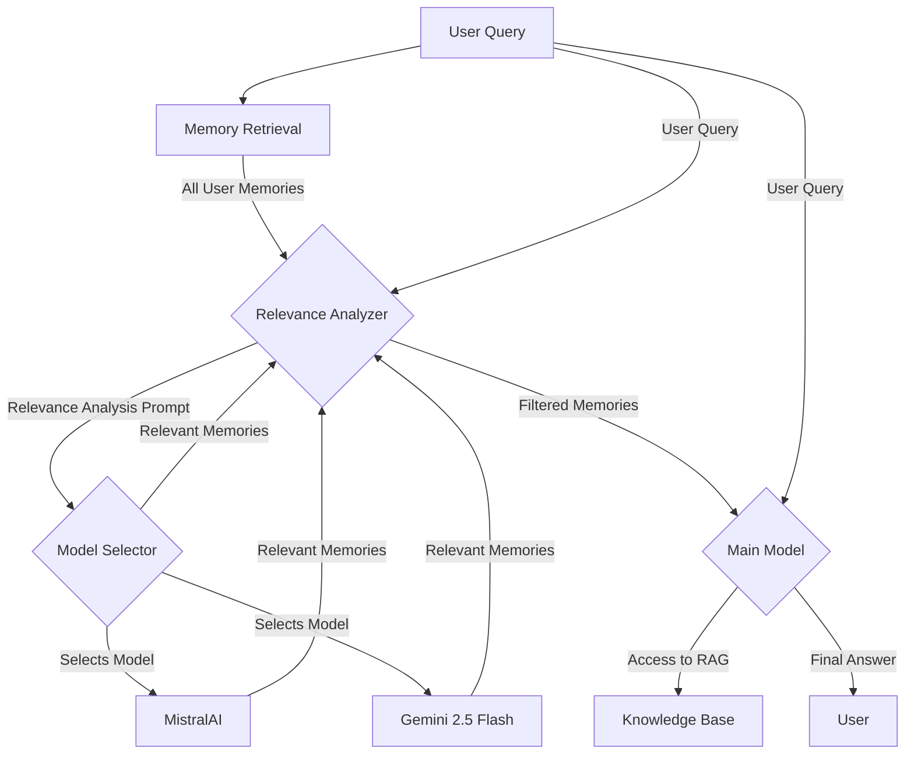

# Revised Design Document: Intelligent Memory System

## 1. Overview

This document outlines a revised design for the user-specific memory system. The core problem with the previous approach is that a simple similarity search is insufficient to bridge the reasoning gap between a user's query and their stored memories. This revised design introduces an intelligent relevance analysis step, which uses a smaller, cost-effective language model to analyze the user's query and memories, identifying potential relevance that requires a reasoning step.

## 2. Requirements

*   **Intelligent Relevance Analysis:** Implement a process where a smaller, faster model analyzes the user's query and stored memories to identify potential relevance.
*   **Advanced Prompting Strategy:** Develop a detailed prompt for the smaller model to guide its reasoning process.
*   **Revised Data Flow:** Create a new data flow that incorporates the relevance analysis step.
*   **Appropriate Model Selection:** Justify the use of a model like Gemini 2.5 Flash for the relevance analysis.

## 3. Architecture

The revised architecture includes a new "Relevance Analyzer" component that sits between the memory retrieval and the final call to the main model.



*   **Memory Retrieval:** Retrieves all memories associated with the user from the database.
*   **Relevance Analyzer:** This new component orchestrates the relevance analysis. It takes the user's query and all their memories, uses a specialized prompt to ask a smaller LLM to perform a reasoning step, and then filters the memories based on the LLM's response.
*   **Main Model:** The final, more powerful model that receives the user's query and only the *most relevant* memories, leading to a more focused and accurate response.

## 4. Data Flow

1.  **Query Initiation:** The user sends a query (e.g., "what pant mod should I use?").
2.  **Memory Retrieval:** The system retrieves all stored memories for that user from the database (e.g., `["mains boom boom", "likes to explore far away", "favorite color is blue"]`).
3.  **Relevance Analysis & Model Selection:** The **Relevance Analyzer** takes the query and the full list of memories. Based on configuration, it selects the primary model (MistralAI) for the analysis. If the primary model fails or its output is unsatisfactory, it can fall back to the secondary model (Gemini 2.5 Flash). It sends the request to the selected model with a carefully crafted prompt.
4.  **Filtering:** The small model analyzes the request and returns a structured list of memories it deems relevant, along with its reasoning. For example:
    ```json
    {
      "relevant_memories": [
        {
          "memory": "mains boom boom",
          "reason": "The user's memory 'mains boom boom' likely refers to a game build. The main model can access the RAG to find build details, which would include information on pant mods for that build."
        }
      ]
    }
    ```
5.  **Final Context Injection:** The **Relevance Analyzer** parses this JSON output and injects only the identified relevant memories into the context for the main model.
6.  **Final Answer Generation:** The main, more powerful model receives the original query and the filtered, highly relevant memories. With this focused context, it can now effectively use the RAG to find the "boom boom" build and extract the appropriate pant mod recommendation.

## 5. Prompting Strategy for Relevance Analyzer

This prompt is critical. It instructs the smaller model to think step-by-step and act as a filter, considering the capabilities of the main model.

```
You are a helpful and intelligent assistant responsible for analyzing a user's memories to determine their relevance to a given query. Your goal is to identify memories that could provide useful context for a larger, more powerful AI that has access to a comprehensive knowledge base (RAG).

The connection between a memory and the query may not be direct. You need to think step-by-step about how a memory might be related, even if it requires a reasoning leap.

**User Query:**
"{user_query}"

**User Memories:**
{user_memories_list}

**Your Task:**

1.  **Analyze the Query:** Understand the user's intent. What are they asking for?
2.  **Review Each Memory:** For each memory, consider if it could be related to the query, even indirectly.
3.  **Reason Step-by-Step:** Think about the potential connections. For example, if the query is about a "pant mod" and a memory is "mains boom boom," reason that "boom boom" might be a "build," and information about that build in the RAG would likely contain details about pant mods.
4.  **Output a Structured List:** Your final output must be a JSON object containing a list of only the relevant memories. For each relevant memory, provide a brief explanation of why it is relevant.

**Example:**

**User Query:** "what pant mod should I use?"
**User Memories:** ["mains boom boom", "likes to explore far away", "favorite color is blue"]

**Your JSON Output:**
{
  "relevant_memories": [
    {
      "memory": "mains boom boom",
      "reason": "The user's memory 'mains boom boom' likely refers to a game build. The main model can access the RAG to find build details, which would include information on pant mods for that build."
    }
  ]
}

Now, perform the analysis for the provided query and memories.
```

## 6. Tool/Model Selection

This system employs a flexible, dual-model strategy for the relevance analysis step to balance performance, cost, and reliability.

**Primary Model: MistralAI**
*   **Role:** The default choice for relevance analysis.
*   **Strengths:** Mistral models are well-regarded for their strong performance-to-cost ratio and excellent reasoning capabilities, making them a powerful primary option for understanding nuanced connections.
*   **Implementation:** The system will first attempt the relevance analysis using the designated MistralAI model.

**Secondary/Fallback Model: Gemini 2.5 Flash**
*   **Role:** Acts as a fallback or an alternative option if the primary model's output is insufficient.
*   **Strengths:**
    *   **Cost-Effectiveness:** Gemini 2.5 Flash is highly economical, which is critical for a check that runs on every user query.
    *   **Speed:** It offers very low latency, ensuring the relevance check remains a fast, non-intrusive step.
    *   **Reliability:** It provides a solid baseline of reasoning capability, making it a dependable fallback to ensure the system remains operational and effective.

**Strategy:**
The implementation will allow for a configuration where **MistralAI** is used by default. A validation step will check the quality of its JSON output. If the output is malformed, empty, or deemed low-quality by a set of heuristics, the system will automatically retry the analysis using **Gemini 2.5 Flash**. This provides a robust, two-tiered approach to the critical relevance analysis step.