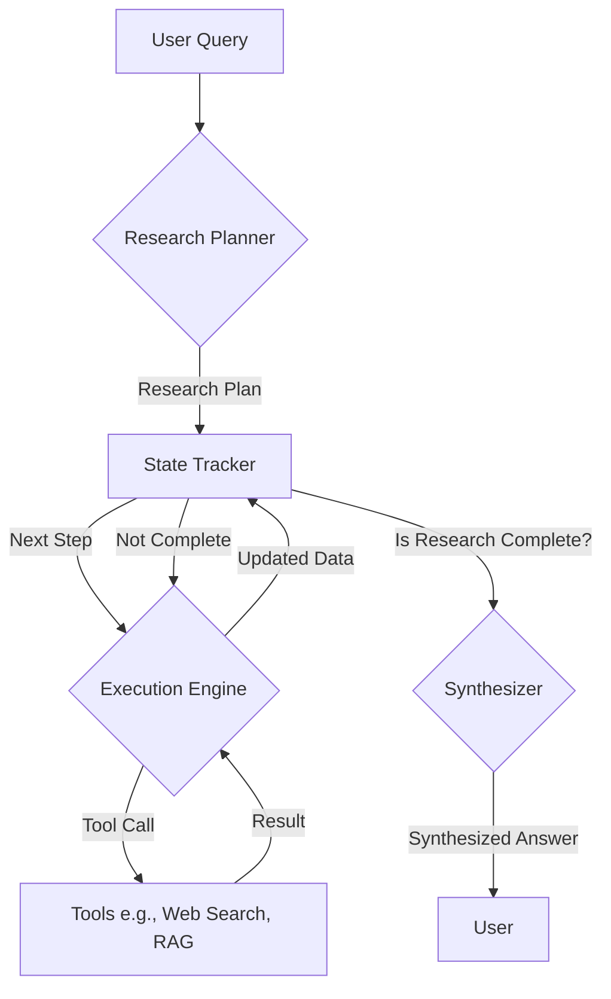

# Design Document: Multi-Step Research Capability for Discord Bot

## 1. Overview

This document outlines the design for an advanced, multi-step research capability for the Discord bot. The system will enable the bot to answer complex user questions by decomposing them into a series of research steps, executing those steps, and synthesizing the collected information into a comprehensive answer. This approach is inspired by agentic frameworks like LangChain and AutoGen, focusing on a structured, stateful, and iterative process.

## 2. Requirements

*   **Query Decomposition:** Break down complex questions into a logical sequence of smaller, answerable questions.
*   **State Management:** Maintain the state of the research process, including the overall goal, completed steps, pending steps, and collected data.
*   **Iterative Tool Use:** Execute tools (e.g., web search, database query) repeatedly, using the output of one step as input for the next.
*   **Information Synthesis:** Combine the results from all steps into a single, coherent, and well-structured final answer.

## 3. Architecture

The proposed architecture consists of four main components: the **Research Planner**, the **State Tracker**, the **Execution Engine**, and the **Synthesizer**.



*   **Research Planner:** This component is responsible for the initial query decomposition. It takes the user's complex question and creates a structured research plan.
*   **State Tracker:** This acts as the "memory" of the research process. It holds the research plan, tracks which steps have been completed, and stores all the data gathered so far. It is the central hub of the operation.
*   **Execution Engine:** This component is the "worker." It takes a single research step from the State Tracker, determines the appropriate tool to use, executes it, and passes the result back.
*   **Synthesizer:** Once all research steps are complete, this component takes the final collection of data from the State Tracker and generates a comprehensive answer for the user.

## 4. Data Flow

1.  **Initiation:** A user sends a complex query to the bot (e.g., "Can you give me details about every food buff in the game, including their location and coordinates?").
2.  **Planning:** The **Research Planner** receives the query. It uses a powerful language model (prompted specifically for planning) to generate a JSON object representing the research plan.
3.  **State Initialization:** The generated plan is loaded into the **State Tracker**. The state is marked as `IN_PROGRESS`.
4.  **Execution Loop:**
    a. The **State Tracker** provides the next `PENDING` step to the **Execution Engine**.
    b. The **Execution Engine** analyzes the step (e.g., "Find a list of all food buffs") and selects the best tool. This could be a `web_search` tool or a `rag_query` tool.
    c. The tool is executed, and the result is returned to the **Execution Engine**.
    d. The **Execution Engine** passes the result back to the **State Tracker**, which updates the corresponding step to `COMPLETED` and stores the retrieved data.
5.  **Iteration:** The loop continues. For subsequent steps, the **Execution Engine** can use the data already collected in the **State Tracker** to inform its tool calls (e.g., using the list of food buffs from step 1 to search for the effects of each buff in step 2).
6.  **Synthesis:** When the **State Tracker** sees that all steps are `COMPLETED`, it passes the entire state object to the **Synthesizer**.
7.  **Final Answer:** The **Synthesizer** uses a language model (prompted for summarization and formatting) to generate a final, well-structured answer from the collected data. This answer is then sent to the user.

## 5. State Representation

The state will be a JSON object, making it easy to manage, store, and pass between components. It can be stored in-memory for a single research task or persisted in a database like Redis for more complex, long-running tasks.

**Example State Object:**

```json
{
  "researchId": "unique-id-12345",
  "originalQuery": "Can you give me details about every food buff in the game, including their location and coordinates?",
  "status": "IN_PROGRESS", // PENDING, IN_PROGRESS, COMPLETED, FAILED
  "collectedData": {
    "food_buff_list": null,
    "buff_effects": {},
    "buff_locations": {}
  },
  "plan": [
    {
      "stepId": 1,
      "description": "Find a comprehensive list of all food buffs in the game.",
      "status": "PENDING", // PENDING, IN_PROGRESS, COMPLETED
      "tool": "rag_query",
      "parameters": {
        "query": "list of all food buffs"
      },
      "output_key": "food_buff_list",
      "result": null
    },
    {
      "stepId": 2,
      "description": "For each food buff, find its specific effects.",
      "status": "PENDING",
      "tool": "rag_query",
      "parameters": {
        "query": "effects of {item}"
      },
      "depends_on": 1,
      "iterate_over": "food_buff_list",
      "output_key": "buff_effects",
      "result": {}
    },
    {
      "stepId": 3,
      "description": "For each food buff, find its recipe location and coordinates.",
      "status": "PENDING",
      "tool": "rag_query",
      "parameters": {
        "query": "location of {item} recipe"
      },
      "depends_on": 1,
      "iterate_over": "food_buff_list",
      "output_key": "buff_locations",
      "result": {}
    }
  ]
}
```

## 6. Prompting Strategy

**A. Research Planner Prompt:**

The key is to get the model to think step-by-step and output a structured plan.

```
You are a master research planner. Your task is to break down a complex user query into a series of simple, sequential research steps. For each step, you must define the goal, the tool to use, and the information to extract.

The output MUST be a valid JSON object following this structure:
{
  "originalQuery": "The user's original question",
  "plan": [
    {
      "stepId": <integer>,
      "description": "A clear, concise description of this research step.",
      "tool": "<tool_name>", // e.g., "rag_query", "web_search"
      "parameters": { // The parameters for the tool
        "query": "The specific query for this step."
      },
      "output_key": "A key to store the result in the collectedData object."
    }
    // ... more steps
  ]
}

Here are the available tools:
- `rag_query`: Use this to query the internal game knowledge base. Best for specific game mechanics, items, and lore.
- `web_search`: Use this for general knowledge or information that might not be in the local RAG.

User Query: "{user_query}"

Now, generate the research plan.
```

**B. Synthesizer Prompt:**

This prompt focuses on combining the collected data into a user-friendly format.

```
You are a helpful assistant. You have been provided with a collection of research data gathered to answer a user's question. Your task is to synthesize this information into a single, well-structured, and comprehensive answer.

Do not mention the research process itself. Just provide the final answer. Use markdown for formatting (lists, bolding, etc.) to make the answer easy to read.

Original Question: {originalQuery}

Collected Data:
{collectedData_json_string}

Now, generate the final, synthesized answer for the user.
```

## 7. Tooling

*   **New `research` command:** A new Discord command (e.g., `/research <query>`) will be the entry point for this system.
*   **Modified Tool Interface:** Existing tools like `rag_query` and any future web search tools will need to be callable by the **Execution Engine** and return structured data (JSON) rather than just formatted strings.
*   **State Management Abstraction:** A new class or module, `StateTracker`, will be created to handle all operations on the state object (e.g., `state.getNextStep()`, `state.updateStepResult(stepId, data)`). This will keep the logic clean and separated.